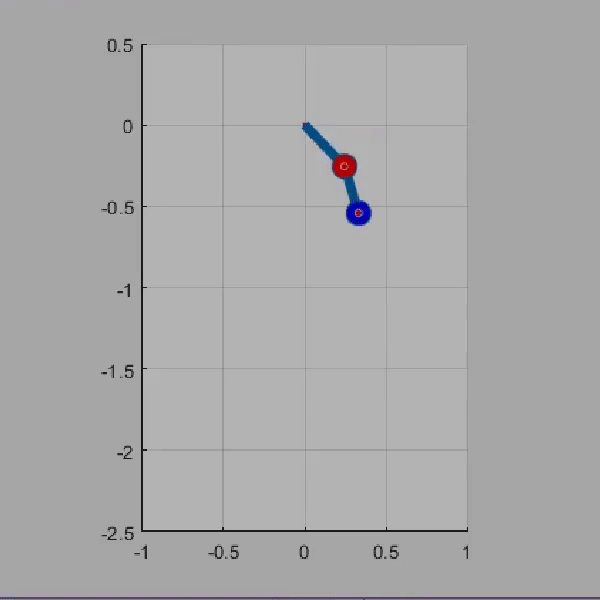

# Flexible_Double_Pendulum

This repository contains files for simulating a flexible double pendulum on Matlab from an assignment in ME6102 (Design of Mechatronic Systems)

***
<table>
  <tr>
    <td>Working of the Model</td>
    <td>Initial Condition</td>
  </tr>
  <tr>
    <td></td>
    <td></td>
  </tr>
</table>

***
The assignment utilized the _ode.m_ function for solving the ordinary differential equation which was further called in _animation.m_. The equations pertaining to the system are given below:

***
Credits for ODE development: [Nambilakshmi](https://www.github.com/rnambilakshmi)